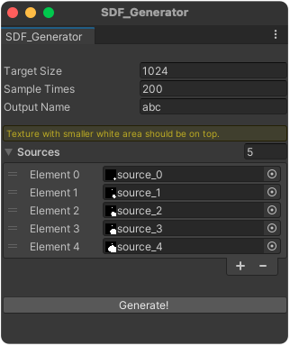

<h1 align="center">Unity SDF Generator</h1>

> Unity SDF generator and SDFs interpolation

  

<h2><em>How to use</em></h2>

Drag the `SDF_Generator.cs` anywhere you want.

 And then you can find it here: ***Windows  > SDF Generator***

<h2><em>Demo</em></h2>

WIP ... ...
